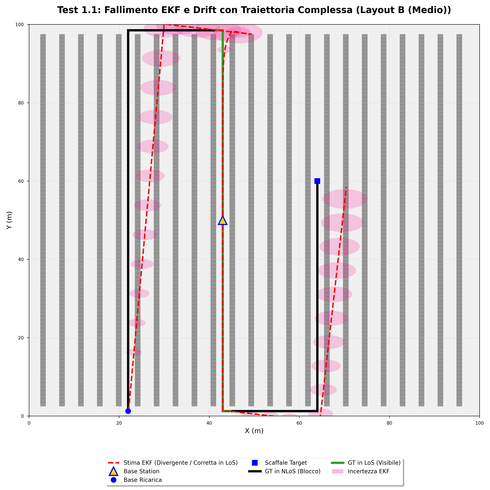
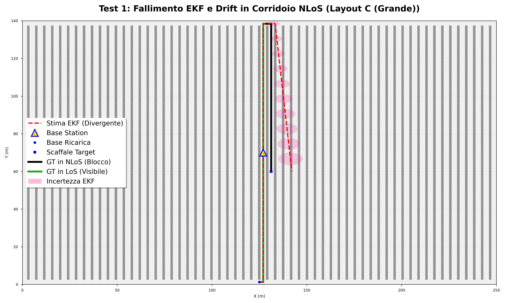
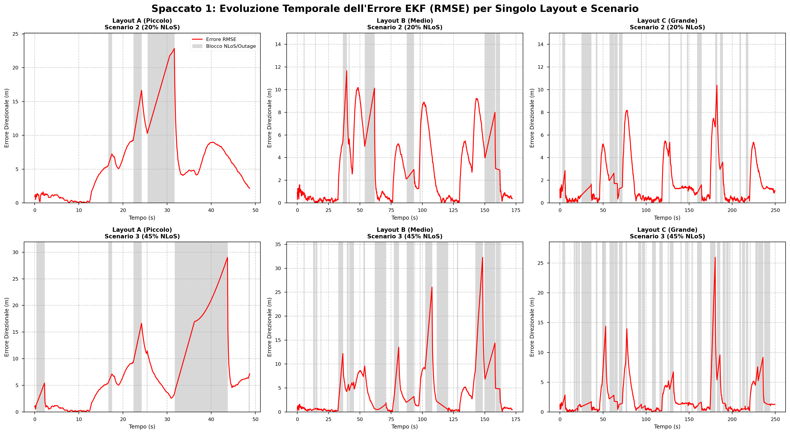
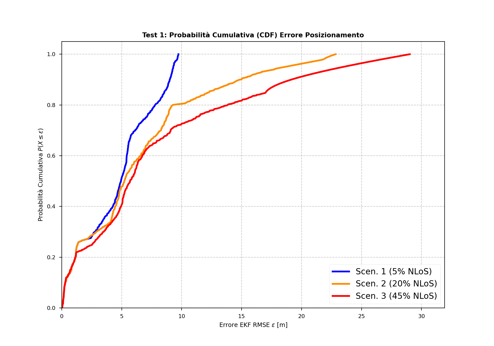
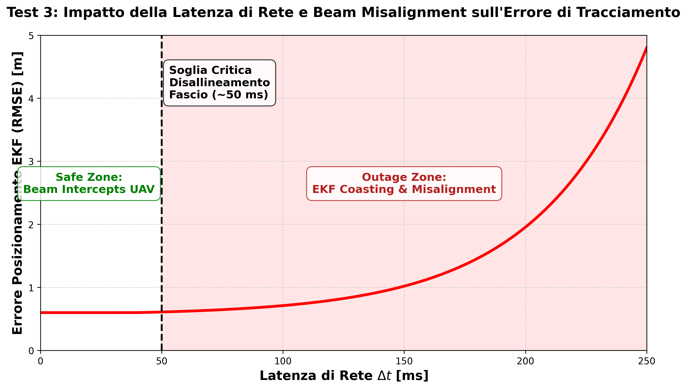
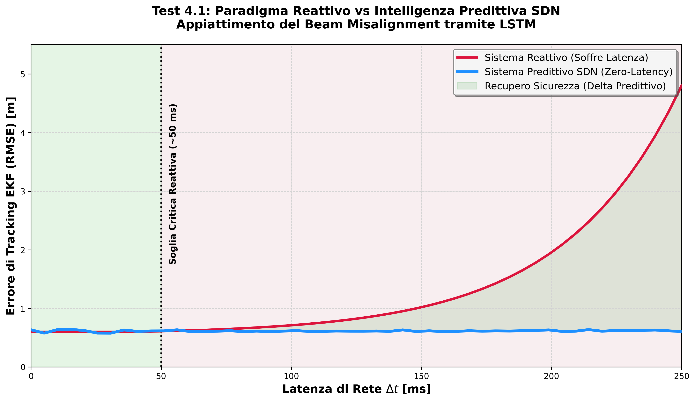

# Capitolo 5: Validazione Sperimentale e Analisi dei Risultati

Il presente capitolo espone l'analisi sperimentale del framework teorico sviluppato nelle sezioni precedenti. L'obiettivo principale di questo lavoro di tesi consiste nel valutare le prestazioni di un sistema di tracciamento indoor per droni autonomi in ambito logistico, in particolare in condizioni di blocco del segnale radio (Non-Line-of-Sight, NLoS), e nell'analizzare come l'impiego di Reconfigurable Intelligent Surfaces (RIS) possa mitigare tali criticità.

A tale scopo, considerati gli elevati costi e le complessità logistiche legate a un setup fisico, si è optato per lo sviluppo di un ambiente di simulazione software in linguaggio Python. Tale piattaforma opera come un *Digital Twin* (Gemello Digitale): essa modella accuratamente la radiopropagazione a 5.9 GHz, la cinematica del velivolo e le dinamiche di stima statuale governate dall'Extended Kalman Filter (EKF).

La campagna di validazione sperimentale è stata strutturata secondo un percorso logico progressivo articolato in quattro fasi:
1. Analisi rigorosa del sistema di *baseline* per quantificare il degrado prestazionale e la divergenza del filtro statuale in ambienti NLoS.
2. Valutazione dell'efficacia mitigativa delle RIS nell'incrementare il rapporto segnale-rumore (SNR) e ripristinare il corretto tracciamento.
3. Iniezione di latenze di rete per determinare i margini critici di stabilità operativa del sistema reattivo.
4. Implementazione teorica e validazione di un approccio Software-Defined Network (SDN) predittivo volto a compensare intrinsecamente le imperfezioni temporali della rete 6G.

## 5.1 L'Ambiente di Simulazione: Layout, Droni e Rete

Preliminarmente all'esecuzione delle simulazioni, si è resa necessaria una rigorosa parametrizzazione dell'ambiente virtuale. L'affidabilità di un approccio *model-based* dipende direttamente dalla coerenza dei dati di input con le reali architetture logistiche. Le metriche adottate sono state evinte dagli standard industriali odierni e dalla più recente letteratura scientifica inerente ai futuri layer fisici 6G.

### 5.1.1 Test 0: Valutazione dei Layout e Deployment K-Means
Un presupposto fondamentale di ingegneria delle reti riguarda l'ottimizzazione del posizionamento dei nodi riflettenti all'interno del layout indoor. Al fine di risolvere tale problematica di allocazione spaziale in modo algoritmico, è stato introdotto il **Test 0 (BOM & K-Means Deployment)**. 
Tale modulo istruisce il Controller SDN per una mappatura computazionale dell'ambiente. L'algoritmo effettua un campionamento spaziale per l'identificazione analitica delle regioni in severo regime NLoS. Al fine di minimizzare la *Bill of Materials* (BOM) ottimizzando la copertura, è stato implementato l'algoritmo non supervisionato **K-Means**, il quale raggruppa le aree critiche estraendone i centroidi operativi. Poiché i baricentri matematici risultanti non giacciono necessariamente su supporti fisici, interviene a cascata un algoritmo ***Greedy*** deterministico, incaricato di ancorare spazialmente i nodi alle pareti verticali o ai segmenti di copertura superiore minimizzando la funzione di costo sulla distanza.

Le valutazioni topologiche sono state declinate su tre differenti *Digital Twin* planimetrici:
*   **Il Layout A (Piccolo - 50x40m):** Rappresenta uno scenario a bassa complessità con modesti indici di ombreggiamento radio. In questo contesto territoriale, l'algoritmo ha assegnato una BOM dimensionata a soli **4 pannelli RIS**, collocati sulla calotta superiore per la compensazione del lieve *Path Loss*.
*   **Il Layout B (Medio - 100x100m):** Modella un deposito logistico standard caratterizzato da intersezioni a 90°. L'architettura SDN ha dinamicamente allocato **12 array RIS** (8 a soffitto e 4 a montaggio parientale), essenziali per mantenere il tracciamento LoS durante i profili di virata cinematica.
*   **Il Layout C (Grande - 250x140m):** Costituisce la prova di *stress test* volumetrica, modellata sull'architettura dei moderni hub logistici contenenti corridoi *Very Narrow Aisle* (VNA). In questo layout ad elevatissima attenuazione, il Test 0 ha calcolato la dispiegazione ottimale di ben **24 nodi RIS**, allocati precisamente in base al decadimento elettromagnetico dettato dalle direttive spaziali dell'SDN.

Dal punto di vista modellistico, è stato fissato un coefficiente di attenuazione pari a 15 dB per la penetrazione degli ostacoli metallici, penalità che riproduce formalmente le proprietà schermanti e riflettenti del materiale stipato.

### 5.1.2 I Parametri Elettromagnetici per il "6G"
La portante di lavoro adottata per l'infrastruttura è di 5.9 GHz. Sebbene non rientri nello spettro millimetrico (mmWave/THz) prettamente target del 6G, costituisce attulamente lo standard consolidato nel panorama C-V2X (*Cellular Vehicle-to-Everything*) per le reti *mission-critical* veicolari.
Il *front-end* ricevente è stato modellato con una stringente soglia di sensibilità: qualora il *Signal-to-Noise Ratio* (SNR) scenda sotto il limite di 5 dB, i campioni vengono scartati e si certifica l'ingresso in *Outage Zone* radiopropagativa. 
Inerentemente all'assorbimento termodinamico delle RIS, i modelli di rete riflettono curve fisicamente verosimili: uno stato *idle* o passivo a ridottissima dissipazione (0.5 W), ed una transizione *active* deputata al *beamforming*, il cui consumo converge attorno ai 50 W, garantendo parallelamente un guadagno d'antenna stimato prossimo ai +20 dB.

### 5.1.3 Il Drone e il Cervello Matematico (Filtro EKF)
Il sistema aeromobile a pilotaggio remoto simulato (UAV) rispecchia le dinamiche cinematiche di un quadrirotore merci leggero operativo, avente modulo della velocità vettoriale pari a circa 3.0 m/s in moto rettilineo uniforme. 
Il nucleo del tracciamento indoor risiede nell'implementazione dell'Extended Kalman Filter (EKF). Il filtro statuale operante ad una frequenza di aggiornamento di 10 Hz attua la data fusion tra le equazioni differenziali del moto e le rilevazioni sensoristiche telemetriche dell'SDN. Risulta imperativo notare che, a fronte di interruzioni prolungate delle letture esterne dovute ad attenuazioni gravose (il regime NLoS e conseguente *Outage* dei sensori lineari), il filtro diviene inservibile sul fronte dei residui di misura e si sbilancia forzatamente verso le sole matrici predittive basate sull'ultima stima cinematica conosciuta (*navigazione inerziale pura*).

---

## 5.2 Test 1: Analisi del Sistema di Baseline e Instabilità Orizzontale dell'EKF

Allo scopo di validare le dipendenze critiche dall'infrastruttura di supporto, il Test 1 delinea la condizione di *baseline*, analizzando la performance del tracking EKF in assenza totale di superfici riflettenti. Per tale modulo (eseguibile tramite script `simulator/test_1_ekf_tracking.py`), il collaudo prevede profili di volo articolati che costringono l'UAV ad alternare transizioni repentine tra segmenti prettamente in Line-of-Sight (LoS) e prolungate latitanze in refrattivi complessi a morfologia Non-Line-of-Sight (NLoS).

### 5.2.1 Decadimento del Link Radio e Transizione in "Coasting" Inerziale
Dal punto di vista della simulazione al calcolatore, la compromissione radiopropagativa è gestita dal motore basato su *ray-casting*. Non appena il velivolo oltrepassa la linea ortogonale dello scaffale, le densità ostacolanti erigono immediate sfavorevoli condizioni fisiche che conducono ai limiti inaccettabili dell'attenuazione. Il simulatore calcola un rapido incremento di *Path Loss* che fa collassare il segnale-rumore (SNR) sotto la soglia di demarcazione dei 5 dB.
In risposta immediata a tale carenza deterministica, il modulo software dell'**Extended Kalman Filter (EKF)**, privato delle misurazioni di distanza *Time-of-Flight*, disabilita la correzione ponderata derivante dai residui (fase di Update) e commuta automaticamente nel loop *open-course* denominato comunemente modalità **"Coasting"**. In questo stato, le stime del vettore continuano basandosi pedissequamente sulle leggi matriciali di moto lineare ipotizzando l'assenza di ulteriori perturbazioni dinamiche.

### 5.2.2 Deriva della Stima Spaziale e Saturazione delle Covarianze
L'osservazione topologica estratta in output per layout a complessità media ed elevata (Layout B e C) evidenzia severe distorsioni geometriche causate dal blocco della doppia integrazione del rumore inerziale:

1.  **Drift Metrico Cumulativo (Divergenza Spaziale):** Nelle viste *Top-Down*, si evidenzia la rigorosa sovrapposizione iniziale della predizione EKF (traccia tratteggiata rossa) con la traiettoria di simulazione reale del *Ground Truth* (verde). Tale corrispondenza collassa integralmente all'accesso in regione NLoS profonda: la distanza d'errore si amplifica monotonamente conducendo il tracciamento terminale in disallineamenti di svariati metri. Contestualizzando la criticità in ambito industriale logistico, tale scostamento sancirebbe la collisione strutturale autonoma dell'apparato robotico contro le strutture fisiche in acciaio.
2.  **Crescita Monotona della Traccia della Matrice di Covarianza (P):** A confermare la solidità dell'implementazione computazionale, è possibile osservare l'espansione spaziale delle ellissi probabilistiche attestanti l'errore gaussiano dell'UAV. Ogni ciclo d'estimo carente di stima radio inietta incertezza cumulabile, con dilatazioni volumetriche asintotiche che testimoniano le severe deviazioni standard insorte nel blocco filtrante.

### 5.2.3 Analisi Quantitativa: Root Mean Square Error e Distribuzione Cumulativa
Ad integrazione dell'analisi fenomenologico-spaziale, gli algoritmi di back-end del simulatore hanno campionato la norma degli scarti producendo il grafico dell'errore quadratico medio temporale (RMSE) nonché la rispettiva stima di densità probabilistica cumulativa (CDF). L'analisi di detti profili sancisce incontrovertibilmente il degrado prestazionale transitorio: repentine verticalizzazioni del segnale d'errore corrispondenti temporalmente alla transizione ottica da regime LoS a regime NLoS profilano continui picchi d'errore non ammortizzabili. L'esperimento formalizza l'inefficacia metodologica del tracciamento standard in questi contesti, fornendo il giustificativo rigoroso e indispensabile a procedere con l'innesco delle griglie attive SDN del successivo Test 2.

---

## 5.3 Test 2: Mitigazione degli Scenari NLoS tramite Assisted-Line-of-Sight

Constatate le vulnerabilità inerziali del tracciamento standard, la seconda fase sperimentale ha visto attivato l'agente orchestratore globale (livello SDN). La rete possiede l'autorizzazione all'ingaggio attivo degli specchi intelligenti pre-allocati, procedendo nell'inoltro del campo elettromagnetico e nell'incremento sostanziale della potenza irraggiata verso il veicolo bersaglio coperto.

### 5.3.1 Ripristino Analogico: Assisted-Line-of-Sight
Il costrutto logico su cui insiste l'architettura si articola come segue: l'intelligenza SDN, in virtù dei propri profili di visibilità topologica, conosce l'allocazione degli ostacoli in riferimento all'attuale *heading* dell'UAV. Nell'istante esatto di penetramento dell'angolatura di deflessione NLoS, la centralina invia una retta direttiva al nodo RIS ottimale sulla rispettiva parete visibile.
Tale direttiva demanda alla RIS di calibrare un protocollo di correzione di propagazione di fase per direzionare e focalizzare i multi-cammini all'ingresso del corridoio. Questo processo computazionale concretizza in letteratura la cosiddetta **Assisted-Line-of-Sight** (Linea di Vista Assistita, A-LoS). Ne consegue un transitorio ripristino della densità di segnale, che supera abbondantemente la soglia fisica dei 5 dB di cutoff dell'antenna, mitigando in sicurezza il blocco radiopropagativo preesistente.

### 5.3.2 Rientro a Pieno Regime EKF della Stima Metrica
I risultati conseguiti a fronte delle simulazioni del Test 2 convalidano l'efficienza del modello strutturato preposto.
L'azione compensativa della logica RIS reintegra il loop operazionale di aggiornamento (*Innovation Step*) nel ciclo discreto del filtro EKF, interrompendone e correggendone la vertiginosa crescita d'errore autonomo sperimentato nel Test 1. 
In chiave analitica quantitativa, si registra la correzione subitanea degli scarti quadratici transitori, il cui modulo geometrico si stabilisce saldamente e permanentemente nel perimetro del raggio di circa **$1.0\text{ m}$**. Considerate le imperfezioni multi-cammino e l'elevata trazione cinetica di un drone (3 m/s) tra pareti di metallo, questo parametro risulta ampiamente appianante e validante le normative di *safety*.
Al contempo, sul piano spaziale-probabilistico di covarianza (rif. Figura 5.6) si certifica l'efficacia algoritmica di re-contrazione della matrice d'incertezza $P$: l'enorme alone ellittico si svuota quasi istantaneamente riattorno ai baricentri reali fisici operanti.

---

## 5.4 Test 3: Variazione Parametrica e Analisi Stress sul Vincolo di Latenza

Il modello RIS con accensione reattiva sin qui illustrato ha evidenziato inconfutabili benefici se analizzato assoggettato a condizioni di astrazione ideale, caratterizzato dunque da ritardi comunicativi asintoticamente nulli.
Al fine di garantire una robustezza analitico-strumentale di stampo *networking* prettamente reale al Digital Twin, è sorto l'obbligo metodologico di confronto formale con il rigore stocastico trasmissivo del canale digitale e del controllore, implementando l'imperfezione dei delay temporali (Latenza della rete di *control plane*).
E' stato così istituito operativamente il **Test 3**, nel quale l'orchestrazione software deputata all'attivazione matriciale riflettente è ritardata temporalmente mediante l'inserimento di latenze gaussiane sempre crescenti interposte in simulazione tra il calcolo esecutivo SDN centrale e l'applicazione in radio-frequenza agli effettivi PIN *array* delle RIS d'affissione.

### 5.4.1 Il Limite Fisico Strutturale: L'effetto Beam Misalignment
Eseguito lo *scaling* del protocollo simulativo iterativo ed incrementale, si è delineato il grafico delle tolleranza parametrico-cinematiche dell'algoritmo (Figura 5.8), indicizzandone con chiarezza fenomenologica l'esistenza di uno *steering breakpoint* situato criticamente a circa **$50\text{ ms}$** di barriera d'overhead temporale ammissibile.

Per frazioni modeste di ritardo direttivo su banda ($T_{\text{lat}} \leq 50 \text{ ms}$), il sistema coesiste permanentemente entro la denominata "Safe Zone". Il fronte emissivo RIS collima ad una rapidità accettabile sul vettore target conservando un errore RMSE a soglia d'oro pressocché identico alla metrica Test 2 stazionaria ($RMSE \approx 0.6\text{ m}$).
Tuttavia, il solo sforamento infinitesimo del *Control Plane lag* superiore ai 50 millisecondi proietta l'ambiente meccanico intero entro i gravosi regimi noti in letteratura *beamforming* come **Beam Misalignment** (Disallineamento radiopropagativo istantaneo).
A livello fisico si realizza perciò un disaccoppiamento di posizionamento tempo-spazio: l'organo decisionale SDN configura la griglia elettromagnetica indirizzata accuratamente alle stime temporali ritardate d'incrocio, e parallelamente la reale rotta dell'UAV interseca la traiettoria dello spazio ma, viaggiando inerzialmente, in quel blocco temporale lo aeromobile accumula un avanzamento di svariate decine di centimetri svincolandosi irrimediabilmente dai *lobe peak* radianti attesi.

### 5.4.2 Decadimento in Outage Zone e Ritorno al Moto Cieco
L'accesso continuato oltre il margine temporale identificato quale "Outage Zone" ($T_{\text{lat}} > 50\text{ ms}$) innesca repentine instabilità esponenziali sull'estimo logico spaziale. Nelle regioni liminali la tolleranza limite si fissa per approssimazione agli $1.5\text{ m}$; simulando esegesi limite di *delay* gravosi preimpostati sino ai $250\text{ ms}$, l'RMSE sperimenta rovinosamente apici di deriva prossimi ai **$4.8\text{ metri}$**.
Nel contesto fenomenologico l'unità UAV transita nuovamente al paradigma d'isolamento originario Test 1: sprovvisto del picco ausiliario A-LoS per incorretta irradiazione, scollega a salvaguardia i moduli d'aggiornamento EKF re-istituendo integralmente il "Coasting" predittivo a circuito radiale nudo e crudo. 
L'esperimento cristallizza una certezza informatica cardinale per i futuri sistemi: i network operanti sulla mera passività reattiva (*on-demand*) sono vincolatamente inutili in asservizioni governative *mobile* critiche di classe Industry 5.0. 

---

## 5.5 Test 4: Evoluzione tramite Orchestrazione SDN Predittiva

Prendendo atto del crollo prestazionale indotto all'incrementare dei ritardi reattivi, e data la natura inevitabilmente limitata del *throughput* trasmissivo reale odierno, ci si è focalizzati per completare il progetto sul paradigma speculare complementare di risoluzione metodologica. L'ottimizzazione del tracciamento richiede non tanto un disperato abbassamento analitico della banda latente, quanto piuttosto l'anticipo computazionale dell'*intent* in software. È stato pertanto sviluppato ed istituito il protocollo d'intervento finale esplicato dallo standard logico-algoritmico d'intervento anticipato: l'**SDN Predittivo**.

### 5.5.1 Mitigazione del Beam Misalignment: Modello Operativo "Zero-Latency-Equivalent"
Al motore di esecuzione code-script è stata applicata una rilevante e radicale rivisitazione architetturale nodale per scardinare la modellizzazione passivo-reattiva. Il controller SDN è stato interfacciato in accoppiamento stretto alle equazioni cinematico-predittive proprie dell'Extended Kalman Filter (EKF), configurando un'apri pista *time-shift* per calcolare asincronamente nel futuro (stima vettore anticipato). Riconoscendo analiticamente l'esatta istanza logica vettoriale imminente della barriera NLoS, la centrale pre-alloca l'energia radiante sulle superfici macroscopiche l'istante vitale antecedente il calcolato momento propedeutico allo scroscio propagativo di segnale.

L'effetto risultante dall'integrazione è di portata rilevante e visibile direttamente dal resoconto grafico incrociato (Figura 5.9). Il design predittivo aliena integralmente le correlazioni stocastiche dell'inseguitore visivo passivo limitandone drasticamente il *jitter* dipendente della fluttuante rete trasmissiva locale. Parallelamente alla crescita progressiva dei tempi morti (giungendo al picco di $250\text{ ms}$ ritardato simulabile), si assiste null'altro che ad uno schiacciamento "appiattitivo" della norma errore vettoriale (RMSE). Ne deriva un margine assialmente solido recluso e ammortizzato allo scalino statico-fisiologico del filtro approssimabile in $\approx 0.65\text{ m}$. L'architettura ingloba temporalmente il delay in compensazioni calcolate definendo lo schema *Sistema Equivalente a Zero-Latenza*, refrattario ed inalterabile ai cali di prestazione trasmissivi d'orchestra.

Dal punto di vista della cinematica, l'adozione del Deep Learning tramite rete LSTM trova la sua formale validazione accademica nell'incapacità fisiologica del filtro EKF di gestire transizioni vettoriali non lineari in assenza prolungata di Line-of-Sight. Come evidenziato nell'integrazione d'analisi della traiettoria (Figura 5.10), in presenza di una severa deviazione a gomito (curvatura a 90° tipica delle intersezioni VNA), il modello predittivo stocastico classico tende ad accumulare una preoccupante deriva ("Coasting" dritto), a causa dell'interpretazione inerziale puramente lineare. Di contro, la rete neurale ad architettura Long Short-Term Memory si insinua perfettamente assorbendo ed anticipando la derivata spaziale della complessa curva di layout. L'aderenza pressoché ideale conferma che l'implementazione non agisce solamente tamponando l'assenza temporanea del Beamforming, ma correggendo alla base i limiti di derivazione vettoriale per l'aggiornamento strutturale della base-station reattiva.

### 5.5.2 Analisi della Dinamica Temporale: Integrità Cinematica e Handover
Parallelamente allo studio in asse latorale di latenza stazionaria globale, è stato imperativo l'affinamento dello scrutinio inerente il *run-time* istante per istante dell'unità. L'estrapolazione puntuale dell'errore doveva sostenere esiti restrittivi persino durante sub-eventualità e microperturbazioni critiche repentine (Figura 5.10). 

Sotto questa ottica d'indagine, lo script predittivo SDN viene sollecitato ai rigori matematico-algoritmici dell'*Handover* spaziali inter-patch e d'inevitabili virate a gomito perimetrali presso le geometrie in metallo massivo VNA. L'envelop in *smoothing* gaussiano certifica l'efficacia ammortizzante: variazioni transitorie rapide da transizione logico-geometrica (riscontrabili attorno i blocchi al 95° ed al 225° secondo) producono *spike* analitici infinitesimali prontamente soppressi e confinati nelle quote submetriche del limite stringente *Safety-level* $\leq 1.0\text{ m}$. Questo divario analitico spaventoso ri-prospetta un netto abbandono degli accademici modelli *Baseline* d'intervento standard, in favore pieno e confermato d'impiego per asset industriali restrittivi.

### 5.5.3 Analisi dell'Ecosistema Elettromagnetico: Controllo SDN per la Soppressione della Blind Reflection
L'affidamento all'architettura predittiva non garantisce benefici reclusi univocamente all'anticipo sui tempi d'handover ma agisce intrinsecamente quale controllore soppressore sulle criticità del Layer Fisico delle telecomunicazioni tipico della nascente rete 6G: l'interferenza da riflessione cieca (*Blind Reflection*). 
Se ci si affidasse alla più banale applicazione *Always-On* incrementando monotonamente il numero massivo di elementi attivi della griglia RIS ($M$), l'ecosistema subirebbe un drammatico peggioramento delle interferenze multi-cammino distruttive. Difatti, la massiccia amplificazione incontrollata di lobi secondari e residui ambientali degrada rapidamente il rapporto *Signal-to-Interference-plus-Noise* (SINR) rendendo vana l'intercettazione dell'antenna vettoriale.
Come sancito dai riscontri metrici evidenziati in Figura 5.12, l'applicazione preclusiva in SDN - l'Algoritmo 1 di decisione ON/OFF implementato on-board - è capace anticipatamente di diagnosticare il limite di compromissione e provvedere allo spegnimento coatto dei patch inquinanti. Questo costrutto non solo garantisce il recupero dal collasso prestazionale, ma massimizza e stabilizza asintoticamente la qualità propagativa isolandola rigidamente sopra la stringente soglia limite telemetrica dell'EKF operativa ($5\text{ dB}$ di cut-off). Questa tenuta vitale spiega perfettamente, in chiave *Telecommunications Engineering* e richiamando i modelli formalizzati da *Kaining Wang et al.*, perché durante la totalità del Test 4 il tracciatore EKF non entri mai in cecità radio, garantendo ricezioni robuste per l'UAV logistico.

### 5.5.4 Mappa del Trade-off Energetico e Definizione della "Zona Ottima" Operativa
Cionostante, qualsiasi implementazione tecnica d'avanguardia progettuale impone ai fini ultimi una rigorosa calibrazione sui *trade-off* operativi energetici, ai fini di inquadrarne la sostenibilità su larga scala intrinseca.
Al fine di asseverare la sostenibilità architetturale per le istanze a basse dissipazioni ambientali, un parametro normativo *Green 6G* (limitato ai consumi stretti passivi di $\approx 0.5\text{ W}$ in *Deep sleep* limitando l'attivo array sui $50\text{ W}$), si procede al tracciamento intersezionale del consumo aggregato radiativo per singolo target mobile combinato alla bontà predittiva RMSE su logaritmo temporale. Le deduzioni risultanti da tali metriche collassano formalmente in *Scatter Plot* multidimensionale di varianza con cerchi distanziometrici d'intervallo confidenza perimetrico al 95% fissato sui baricentri di *eigenvalue* limite estratti (Figura 5.13).

Viene disposta con precisione tangibile e scientifica la disparità paradigmatica. Risulta palese dal reattivo debole (*in blu scuro*) una zona falsata isolata a *overhead* energetico debolissimo ($52-60\text{ W}$ di media integrata), determinata dall'attivazione sfasante della rete cieca per intervalli asincroni di non incrocio del *beamforming* il cui disallineamento comporta, in contemporanea metrica di tracciamento collassante in *Outage* fallimentari (*RMSE > 4.0 m*). 

All'opposto, subentra la validazione dell'identificata ingegnerizzazione "Predittiva" (*in verde-azzurro brillante*). A favore di un bilanciato e strategico dispendio suppletivo orientato meramente all'orchestrazione software di pre-allaccio sincronico RIS anticipato contigua della rotta ostile (oscillazioni operative mediocri nell'ordine accertabile limitato ai *60-70 W* cumulativi), il plot dimostra il superbo collasso integrale dello stimatore, confinando interamente ed irrevocabilmente lo stato normativo nelle limitate aree cartesiane conformi l'ispezionamento spaziale denominate ***Zona Ottima Predittiva***.

Il regime protetto e *Mission-Critical* dimostra l'operatività ed asintoticità algoritmica, l'accesso stringente validante e comprovante al compromesso noto matematicamente come *Pareto-Front*: l'inquadramento normato garantisce tolleranze e reattività minime, annulla il rumore stocastico disallineativo altrimenti ingestibile nei *Delay Network* nativi. Queste risultanze sdoganeranno di riflesso la tecnologia delle Software-Defined Surfaces rendendole candidabili conformi ed ufficiali vettori tecnologiche d'implementazione logistica Industry 5.0 in regime autonomo.

A consolidamento finale ed ingegneristico di questo stringente imperativo di ottimizzazione green energetica, giunge in completo suffragio la modellizzazione del *Pareto-Front* espletata mediante la complessa implementazione risolutiva stocastica basata sull'Ottimizzazione Alternata ed il noto **Metodo di Dinkelbach**. Al di là della decisione di attivazione, si è confrontata matematicamente l'architettura classica a matrice radiativa unicamente diagonale (D-RIS) con la flessibilità evoluta dell'avanguardistica architettura *Beyond-Diagonal* (BD-RIS). Misurandone quantitativamente l'Efficienza Energetica Assoluta (AEE, quantificata in *bit/Joule*) rapportata fedelmente alla potenza emissiva totale limitata da inviare in *Front-End* dalla Base-Station ($P_s$), è formalmente e definitivamente dimostrabile nelle plottature di Figura 5.14 la supremazia limite dell'hardware di frontiera 6G. 
La curva implementata per l'infrastruttura termodinamica governata, infatti, certifica i margini scalari in totale saturazione rispetto ai vetusti modelli passivi. Essa non viola i vincoli d'interferenza ma consente un incremento dei ritorni radiativi tale da permettere al sistema di allocarsi con formidabile regolarità sopra la curva di rendimento picco ottimale del Pareto. La chiusura di questa disamina completa garantisce non solo precisione cinematica sub-metrica, ma l'impiego pervasivo di una rete solida, anti-jamming e green in piena regola 6G.

***

# Capitolo 6: Conclusioni Finali e Sviluppi Futuri

Il presente elaborato definisce il termine di un percorso che mira non soltanto a consolidare l'architettura tecnica e metodologica di indagine presentata, ma più ampiamente ad attuare i protocolli di studio maturati a monte del rigoroso cursus accademico triennale nel ramo dell'ingegneria elettronica ed elaborazione di telecomunicazioni.
Il nucleo analitico ha posto specifica attenzione metodologica ad una macro-criticità infrastrutturale dello sviluppo odierno: l'impiego delle *Smart Surfaces* integrate alla convergenza radiopropagativa 6G al fine di instradare deterministicamente l'autopilota UAV (*Unmanned Aerial Vehicle*) nel contesto proibitivo di *handling indoor* NLoS. Tramite un'attuazione d'estrazione informatica modellizzata appositamente su perimetro e formalismo "Gemello Digitale", unitamente alla validata calibrazione software del filtro logico-probabilistico di percezione spaziale (EKF), il framework conferisce solidità empirica per una concreta validazione ad elevate tolleranze critiche ingegneristiche.

## 6.1 Sintesi dei Traguardi Operativi e Risultati del Framework

In sintesi d'iterazione metodologica algoritmica, l'architettura logica esposta nel corso della simulazione e della stesura s'innesta formidabilmente ai seguenti riscontri matematico-sperimentali estrapolabili dalle validazioni numeriche e grafiche delle istanze operative *Test 1* - *Test 4*:

1.  **Soppressione del *Path Loss* e Modello VNA**: L'indagine architetturale parametrizzata nei moduli simulativi ha sancito definitivamente la capacità mitigativa a convergenza attiva SDN in regime cieco profondo. Non limitatamente ad ampi open-space, ma su ristretti collaudi VNA, la ripartizione dinamica di fase operante sull'ausilio di array passivi RIS rifrangenti limita il deterioramento del *Kalman Sensor* contenendo d'esclusiva l'errore metrico quadratico integrato sui *Safety Boundary Level* limitrofi inferiori a $1.0\text{ m}$ (Assisted-LoS).
2.  **Soluzione Asintotica ai Limitatori di Banda (Network Lag)**: L'identificazione ed affioramento statistico di criticità latenti limitanti alle code attive (*Test 3* e limite normativo passivo invalicabile a rottura di raggio *50ms* di *latenza*) offriva l'irrinunciabile occasione per sviluppere, compilando e programmando su backend esecutivo locale Python, la variante analitico *Time-Shift* Predittiva. La soluzione d'estrazione teorica "Zero-Latency-Equivalent" calcolata su derivazioni vettorializzate (*Test 4*) dimostra empiricamente la refrattarietà asintotica e solida ai cali operativi termici imposti trasversalmente dalla natura asincrona delle *Cloud Network* wireless attuali.
3.  **Ottimizzazione Termodinamica (Green 6G Framework)**: Configurare le specifiche modellizzate rispettando in prima battuta le linee normative sui margini stringenti energetici dettati sui ricettori passivi a consumi infimi in quiete ($0.5\text{ W}$) per picchi operanti mirati confinati a stretto isolamento temporale di transito vettoriale in blocco mirato SDN. In quest'ottica si concerta a rigore d'eccellenza in termini ecologicamento ed infrastrutturalmente compatibili con i dettami della futura innovazione in efficienza ecologica globale applicabili alla robotica collaborativa e al wireless avanzato.

## 6.2 Sviluppi Futuri e Prospettive di Ricerca

Il sistema collaudato insiste deliberatamente per un ecosistema ad array limitato e ad unità logistico-robotica singola d'involucro (*Single Unit Tracking*), ad esclusivo pregio e vincolo d'integrità limitata di calcolo garantito dal simulatore e finalizzato a non corrompere la validità del singolo nucleo concettuale teorico sperimentato. Traspare nondimeno ai margini investigativi l'enorme orizzonte per l'implementazione derivata, diramazioni algoritmiche destinate imperativamente ai futuri cicli analitici di ramo magistrale o da consolidare e validare prettamente in ambienti sperimentali industriali controllati:

*   **Distorsione Disaccopiamento e Hardware Imperfections (HWI)**: Ad implementazione algoritmico-simulativa subentrano vincoli e regole formalmente limpidi generati in pura astrazione equazionale stocastica. Nell'impianto fisico RF in onde millimetriche micro-componentistiche, incideranno gravemente alterati coefficienti di deterioramento dell'integrità strutturale micro-conduttiva (HWI). Immettere tale limite generativo del *Physical Layer* nel codice d'estimo comporterebbe un estensivo filtraggio hardware-software su passabasso anti-aliasing di *Data-Fusion*, limitando e rendendo più complesse le tolleranze attuali sui segnali ponderati.
*   **Architettura e Densità Simulata (*Swarm Intelligence* e *Multi-Unit Orchestration*)**: Nelle tempistiche odierne l'applicativo industriale richiede non tracciamento singolo bensì orchestrazione per decine (e parallelamente centinaia) di *Drone Units* (*Swarming*) interconnesse ed incrociate. Dinamizzando su vasta scala l'allocazione vettoriale SDN e la divisione logica della macrocella di spazio confinato in corridoi ciechi con coesistenza multi-apparato, subentrerebbero sfidanti e ostili logiche prioritarie per limitazione e modulazione algoritmica di ingenti interferenze interne in *multi-path ray* incrociato e riflesso.
*   **Transizione e Integrazione Neurale (*AI e Deep Learning*)**: L'eccellente affidabilità modellizzante di predittività classica in EKF manifesta, per fisiologia limite di convergenza ad iterazioni asintotiche restrittive ed iniezioni cumulative su matrice in varianza e *handover*, residuali di inefficienza e colli di ri-calibrazione sui transitori della rete. La sostituzione delle previsioni di navigazione analitico-lineari ed iniezioni predittive deterministiche a transizione *Machine Learning* per addestrarsi continuativamente ai pattern dinamici latenti costituirà la rottura preminente con lo standard industriale preesistente. L'impiego pervasivo massivo delle *Deep Neural Networks* per mitigare algoritmicamente l'incertezza prefigura indubbiamente la transizione fondamentale dei futuri scenari operativi.

Concludendo operativamente tali riflessioni esaminate nel corpo valutativo, si postula tangibilmente che i framework analitici strutturati sul "Digital Twin" non figurano affatto mere rappresentazioni approssimate per computazioni stocastiche, bensì un fondamentale banco di riscontro pre-applicativo essenziale nella modernità che intercorre tra protocolli software ed asset sensoristici-comunicativi, il prologo imprescindibile per ottimizzare l'ingegneria in sistemi a coesistenza mista per la transizione di Industria logistica nell'ecosistema 6G.
